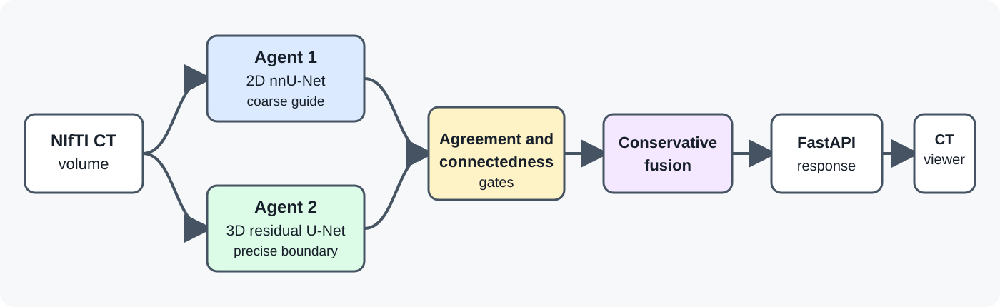

# Dual Agent Pericardial Sac Segmentation

A research prototype for automatic segmentation of the pericardial sac in
computed tomography (CT) volumes. It combines a coarse 2D nnU-Net (an
automatically configured medical image segmentation framework) anatomical
guide with a precise 3D residual U-Net (a neural network that preserves fine
image detail). A conservative fusion layer rejects mismatched results rather
than silently merging them.

## See it working

**[Watch the full run demo (75 seconds)](demo/full_pipeline_demo.mp4)**

The recording shows the complete local workflow on a public SAROS CT: loading
the volume, running both segmentation agents, reviewing the fused result, and
using the viewer's editing controls. The inference wait lasted 1 minute 59
seconds and is clearly shortened in the recording. The results portion is shown
at 2x speed.

Research use only. This software is not a medical device, has not been
clinically validated, and must not be used for diagnosis or patient care.

## What this repository demonstrates

- Complete NIfTI inference through a FastAPI service.
- Comparison of both models plus an automatic fused result.
- Safety gates for disconnected masks, masks outside the expected domain, or
  mutually incompatible masks.
- A browser CT viewer with slice navigation, windowing, overlay control, and
  local paint/erase/smooth/undo tools.
- Checkpoint SHA-256 verification (cryptographic check that confirms saved
  model weight files are unchanged) and data leakage guards.
- Refinement at patient level and a single evaluation on a held out patient.
- A reviewed recording of real inference made from an approved public SAROS CT.

## System overview



Agent 2 supplies the default boundary. Agent 1 can contribute only when its
location, volume, overlap, axial support (the range of CT slices containing the
mask), and connectedness (whether the mask forms one continuous region) are
compatible with Agent 2. The final automatic mask is restricted to one
coherent 3D component.
See [`docs/architecture.md`](docs/architecture.md) for the detailed decision
path.

## Held out evidence

Agent 2 was pretrained on 947 volumes with pseudolabels (automatically generated
training masks), calibrated on a 16/3 split by patient, and fit on 19 patients
with accepted gold standard labels. One additional patient, published here
only as `heldout-001`, was kept outside optimization and checkpoint selection.

| Metric | Pretrained Agent 2 | Refined Agent 2 |
|---|---:|---:|
| Dice | 0.8684 | **0.9273** |
| Precision | **0.9450** | 0.9405 |
| Recall | 0.8033 | **0.9143** |
| Boundary F1 at 1.5 mm | 0.5794 | **0.6666** |

Dice measures overall mask overlap, precision measures how much of the predicted
mask is correct, recall measures how much of the reference mask is found, and
Boundary F1 measures how closely the predicted and reference edges match within
1.5 mm.

These measurements cover 39 annotated slices from one held out patient. They
demonstrate improvement on that case, not generalization across a broader
population.
Nine unannotated slices were excluded. On this scan, Agent 1 failed the
agreement gate and the fused output was exactly Agent 2, with zero changed
voxels. See [`docs/evaluation.md`](docs/evaluation.md) and
[`results/benchmark_summary.csv`](results/benchmark_summary.csv).

## Run locally

Requirements:

- Windows PowerShell and Python 3.11.
- A system with CUDA support (NVIDIA GPU acceleration) containing PyTorch,
  MONAI, nnU-Net v2, NiBabel, SciPy, FastAPI, Uvicorn, and multipart support.
- Authorized Agent 1 and Agent 2 checkpoints (saved model weight files).

The exact verified development versions are recorded in
[`docs/environment_versions.json`](docs/environment_versions.json).

Default model locations are paths relative to the repository. They can be
overridden:

```powershell
$env:AGENT1_MODEL_DIR = "D:\models\agent1"
$env:AGENT2_CHECKPOINT = "D:\models\agent2\final_model.pt"
```

Verify the environment and frozen assets (files fixed to approved versions):

```powershell
.\scripts\verify_installation.ps1
```

Start the API and viewer:

```powershell
.\scripts\run_ct_viewer.ps1
```

The launcher verifies the installation, starts the API on `127.0.0.1:8000`,
opens `ct_viewer.html`, and stops the hidden server process when Enter is
pressed. Full setup and troubleshooting are in [`docs/setup.md`](docs/setup.md).

## Test without model weights

```powershell
python -m unittest -v test_dual_agent_config_v1.py
python -m unittest -v test_dual_agent_paths_v1.py
python -m unittest -v test_dual_agent_fusion_v1.py
node test_ct_viewer_smoothing.js
```

The fusion and frontend tests use synthetic arrays and do not load medical
images or checkpoints.

## Repository guide

| Path | Purpose |
|---|---|
| `server_dual_agent_v1.py` | FastAPI inference and comparison endpoints |
| `dual_agent_fusion_v1.py` | Fusion algorithm with safety gates |
| `dual_agent_config_v1.json` | Frozen thresholds, hashes, and portable paths |
| `dual_agent_paths_v1.py` | Environment and repository path resolver |
| `ct_viewer.html` | Local live inference viewer and mask editor |
| `demo/` | Real inference demonstration recording |
| `docs/` | Architecture, setup, training, evaluation, privacy, and limitations |
| `models/` | Checkpoint placement guidance and model cards |
| `results/` | Machine readable metrics from the held out case |
| `scripts/` | Installation verification and launcher |

## Models and data

Model weights and medical images are intentionally excluded from ordinary Git
history. The two frozen checkpoints are distributed as `v0.1.0` GitHub Release
assets with verified SHA-256 hashes; install them with
`scripts/download_models.ps1`. No training images or labels derived from
patients are distributed. See
[`models/README.md`](models/README.md) and
[`docs/privacy_and_data.md`](docs/privacy_and_data.md).

## Limitations

The final refined model has only one evaluation on a held out patient. Agent 1
was out of domain on that case, fused accuracy has not been established on a
larger external set, and no expert reader or regulatory validation has been
performed. Empty or incoherent results may be intentionally withheld.
See [`docs/limitations.md`](docs/limitations.md).

## Upstream work and license

This project began from the University Medicine Essen SAROS dataset repository
and retains its MIT license and copyright notice. SAROS dataset access and
citations remain governed by their original sources. See
[`docs/upstream_saros_attribution.md`](docs/upstream_saros_attribution.md),
[`citations/LICENSE`](citations/LICENSE), and
[`citations/CITATION.cff`](citations/CITATION.cff).
